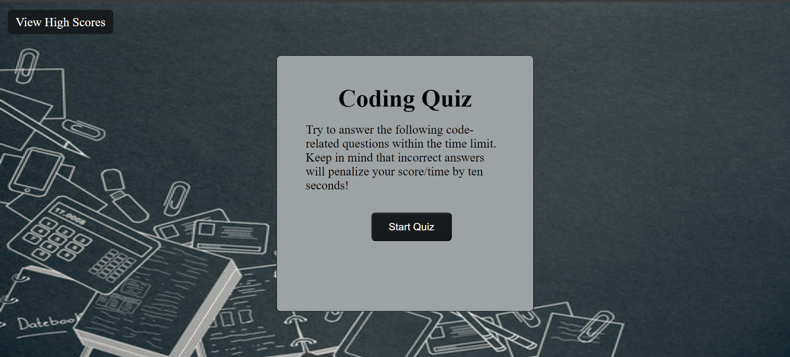

# Web API Coding Quiz
## Description 

Welcome to the Web API Quiz! This interactive quiz is designed for coding and web development enthusiasts to test their knowledge in a fun and engaging way. With 10 thought-provoking questions, this quiz covers a range of topics relevant to coding and web development, challenging both beginners and seasoned professionals alike.

## Features:
* Timed Quiz: Test your knowledge against the clock! The quiz is timed to add an extra layer of excitement and challenge.
* High Scores: Once you've completed the quiz, enter your initials to see how you stack up against others on the high scores leaderboard.
* Retry: Think you can do better? No problem! You can always go back and retake the quiz to improve your score and climb up the leaderboard.

## How to Play:
1. Start the quiz and answer each question to the best of your ability.
2. The timer will start counting down as soon as you begin.
3. Once you've completed all 10 questions, enter your initials to submit your score.
4. Check the high scores page to see where you rank among other players.
5. Feel free to retake the quiz as many times as you like to improve your score and challenge yourself!

Whether you're looking to test your skills, learn something new, or simply have some fun, the Web API Quiz is the perfect way to engage with coding and web development concepts.

## User Story

* AS A coding boot camp student
* I WANT to take a timed quiz on JavaScript fundamentals that stores high scores
* SO THAT I can gauge my progress compared to my peers

## Acceptance Criteria 

* GIVEN I am taking a code quiz
* WHEN I click the start button
* THEN a timer starts and I am presented with a question
* WHEN I answer a question
* THEN I am presented with another question
* WHEN I answer a question incorrectly
* THEN time is subtracted from the clock
* WHEN all questions are answered or the timer reaches 0
* THEN the game is over
* WHEN the game is over
* THEN I can save my initials and score

## Screen Shot

## Application Link

https://thekelsenator.github.io/Web-API-Quiz-04/
